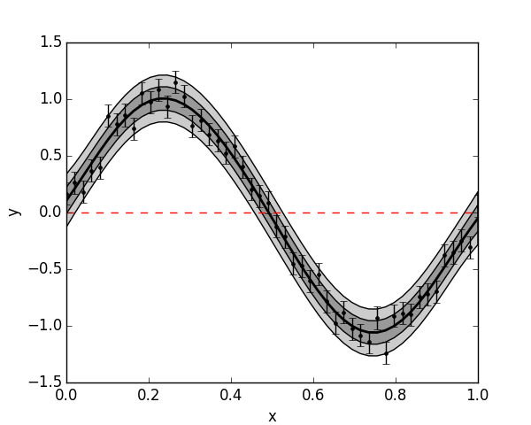

.. _getting started:

Getting started
---------------

First import the module, and almost always numpy too::

  import GeePea
  import numpy as np

Next, define some simple data::

  x = np.linspace(0,1,50)
  y = np.sin(2*np.pi*x) + np.random.normal(0,0.1,x.size)

We also need to define the initial parameters of the GP. By default, we have a zero mean function
and are using the :py:func:`squared exponential kernel <GeePea.SqExponential>`. For a 1D input this takes three parameters, a height
scale, length scale, and white noise::

  p = [1,1,0.1]

Now we are ready to define our simple GP as follows::

  gp = GeePea.GP(x,y,p)

And we can plot out data along with the GP regression::

  gp.plot()

A useful exercise is to explore how the GP behaves with varying hyperparmeters - try changing the
height scales and length scales to see how the fit changes. In general however, we should not
arbitrarily pick the hyperparameters. The simplest thing we can do is optimise our GP likelihood
with respect to the parameters::

  gp.optimise() # by default uses the scipy Nelder-Mead simplex fmin
  gp.plot()

And we have our first GP fit to data!::

  import GeePea
  import numpy as np
  import pylab

  x = np.linspace(0,1,50)
  y = np.sin(2*np.pi*x) + np.random.normal(0,0.1,x.size)

  p = [1,1,0.1]

  gp = GeePea.GP(x,y,p)

  gp.optimise()

  pylab.figure(1,(6,4.8))

  gp.plot()

  pylab.xlabel('x')
  pylab.ylabel('y')
  
