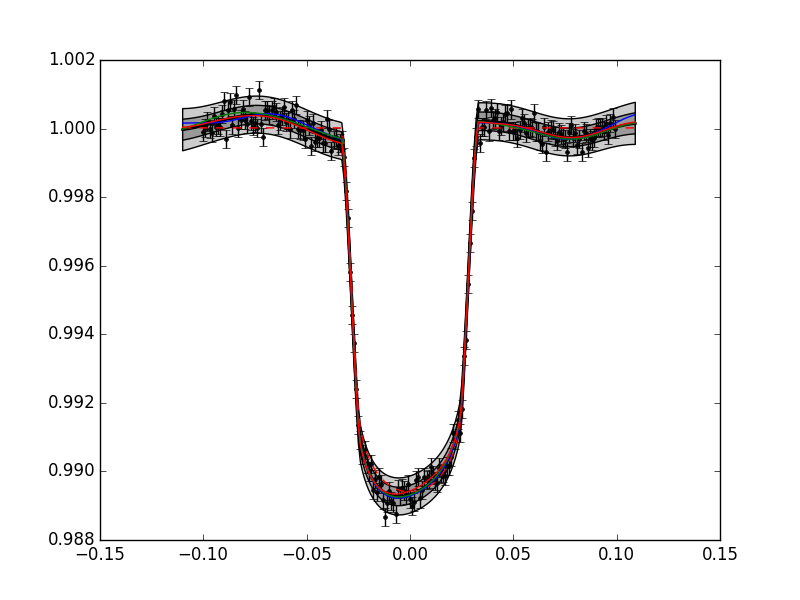

.. mean functions::

Fitting a transit light curve
-----------------------------

For this example I will use the light curve model from MyFuncs module (available from
https://github.com/nealegibson/). This accepts 9 transit parameters, and a time argument, eg.::

  import MyFuncs as MF

  time = np.linspace(-0.1,0.1,200)
  mfp = [0.,2.5,11.,.1,0.6,0.2,0.3,1.,0.] # mean function pars

  flux = MF.Transit_aRs(mfp,time)

First define hyperparameters, and generate some noisy test data, with some 'systematics'::

  hp = [0.0003,0.1,0.0003]

  #create the data set (ie training data) with some simulated systematics
  flux = MF.Transit_aRs(mfp,time) + hp[0]*np.sin(2*np.pi*10.*time) + np.random.normal(0,hp[-1],time.size)

We also need to specify which parameters to fix. We can use the fixed parameters arg (fp),
or alternatively pass an error array to the GP, corresponding to the mean function and kernel
parameters. This is convenineet if we need to specify the errors for an MCMC anyway::

  ep = [0.0001,0,0.1,0.001,0.01,0,0,0.0001,0,0.0001,0.001,0.00001]

Now we can define the GP. We'll just model the systematics as a regularly sampled function of time,
so can use a Toeplitz kernel to speed things up. In this example we'll use the squared exponential
kernel again, but for time-correlated systeamatics, I've found the :py:func:`Matern 3/2
<GeePea.Matern32>` kernel a better option::

  #using normal kernel
  gp = GeePea.GP(time,flux,p=mfp+hp,mf=MF.Transit_aRs,ep=ep) #using normal SqExponential kernel

  #or using a toeplitz kernel
  gp = GeePea.GP(time,flux,p=mfp+hp,kf=GeePea.ToeplitzSqExponential,mf=MF.Transit_aRs,ep=ep)

Now we can optimise and plot as before::

  #optimise the free parameters
  gp.optimise()
  gp.plot()

.. note::

  When using a Toeplitz kernel, the predictive distribution of the GP doesn't work if the
  predictive points do not have the same spacing as the inputs. If this isn't possible, or you
  need a finer grid for plotting/whatever, then you can switch to an equivalent full kernel after
  the optimisation/marginalisation.
  
::

  import GeePea
  import numpy as np
  import MyFuncs as MF
  import pylab

  #define transit parameters
  mfp = [0.,2.5,11.,.1,0.6,0.2,0.3,1.,0.]
  hp = [0.0003,0.1,0.0003]
  ep = [0.0001,0,0.1,0.001,0.01,0,0,0.0001,0,0.0001,0.001,0.00001]

  #create the data set (ie training data) with some simulated systematics
  time = np.arange(-0.1,0.1,0.001)
  time_pred = np.arange(-0.11,0.11,0.001) # pred values need to have same spacing for toeplitz!
  flux = MF.Transit_aRs(mfp,time) + hp[0]*np.sin(2*np.pi*10.*time) + np.random.normal(0,hp[-1],time.size)

  #define the GP
  gp = GeePea.GP(time,flux,p=mfp+hp,kf=GeePea.ToeplitzSqExponential,mf=MF.Transit_aRs,ep=ep,x_pred=time_pred)

  #optimise the free parameters
  gp.optimise()

  #and plot
  gp.plot()
  for i in range(3): pylab.plot(gp.xmf_pred, gp.getRandomVector())

