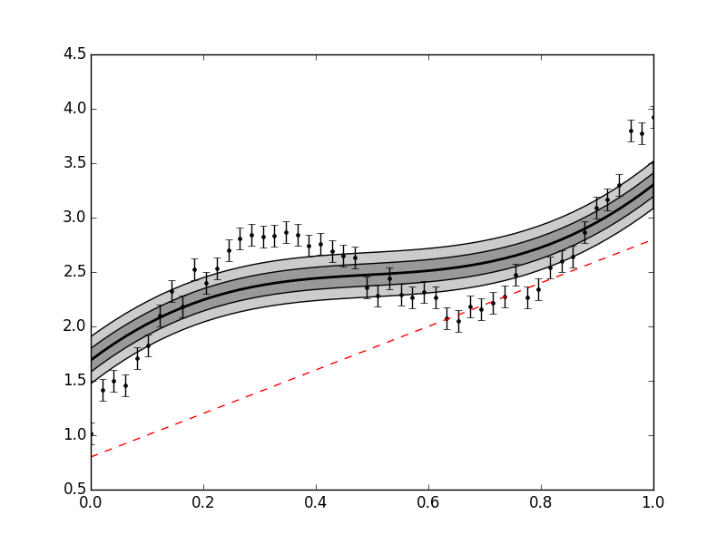

.. mean functions::

Using Mean Functions
--------------------

Mean functions (i.e. a deterministic component) can easily be added to the GP class.
They *must* be callable functions using the following format::

  mean_function(p,args)
	
where p is an array of parameters of the mean function, and args are additional arguments.

For example, we could define a simple mean function that is a linear function of two
parameters as follows::

  my_mean_func = lambda p,x: p[0] + p[1] * x

or alternatively::

  def my_mean_func(p,x):
    y = p[0] + p[1] * x
    return y

Now we can make some simple data using our mean function::

  x = np.linspace(0,1,50)
  y = my_mean_func([1.,3.],x) + np.sin(2*np.pi*x) + np.random.normal(0,0.1,x.size)

Here, we expect the mean function to account for the linear trend, and the GP to account
for deviations from this mean function (plus white noise). We also must define the
(initial) parameters of our GP::

  mfp = [0.8,2.] # mean function parameters
  hp = [1.,1.,0.1] # kernel hyperparameters (sq exponential takes 3 parameters for 1D input)

These parameters are always passed as a single list or array, with mean function
parameters followed by kernel parameters. For built in kernels (or any with n_par
attribute), the GP class will know how to divide the parameters.

And now we are ready to define our GP::

  gp = GeePea.GP(x,y,p=mfp+hp,mf=my_mean_func)

.. note::
	
  By default, the GP will set the mean function arguments to the same as the kernel
  function arguments x, or in the case of multidimensional x, to the first vector in x.
  If the mean function arguments are different to the kernel arguments, then this must
  be given to the GP class via the xmf argument

::

  gp = GPea.GP(x,y,p=mfp+hp,mf=my_mean_func,xmf=mean_func_args)

If is often useful to look at the current state of the GP using the describe method,
which prints out the functions/parameters attached to the GP::

  gp.describe()

We can also plot the current state::

  gp.plot()
  
::

  import GeePea
  import numpy as np

  my_mean_func = lambda p,x: p[0] + p[1] * x
  
  x = np.linspace(0,1,50)
  y = my_mean_func([1.,3.],x) + np.sin(2*np.pi*x) + np.random.normal(0,0.1,x.size)

  mfp = [0.8,2.] # mean function parameters
  hp = [1.,1.,0.1] # kernel hyperparameters (sq exponential takes 3 parameters for 1D input)

  gp = GeePea.GP(x,y,p=mfp+hp,mf=my_mean_func)
  gp.plot()
  

The red dotted line plots the mean function here. Obviously, the guess parameters do
not provide a very good fit for our data. Therefore we need to optimise the mean function
parameters and hyperparameters::

  gp.optimise()

This now provides a much better fit to our data. Note that in some cases we only want to
optimise a subset of our parameters, and hold others fixed. In this case, we can define a fixed
parameter array. This is a series of 1s and 0s that correspond to the mean function plus
kernel function parameters. For example, using the same parameters as before, if we want to keep
the white noise hyperparameter fixed we would also define a fixed parameter array and pass it to
the GP class::

  mfp = [0.8,2.] # mean function parameters
  hp = [1.,1.,0.1] # kernel hyperparameters (sq exponential takes 3 parameters for 1D input)
  fp = [0,0] + [0,0,1] # fixed parameter array - keep final hyperparamter fixed
  #pass to the GP
  gp = GeePea.GP(x,y,p=mfp+hp,mf=my_mean_func,fp=fp)
  #or
  gp.set_pars(fp=fp)

Now if we optimise the GP only the parameters where fp==0 are allowed to vary.

.. note::

  The optimiser uses a wrapper to the fmin functions in scipy.optimize. These tend to work well
  for small numbers of parameters, but for more complex likelihoods it needs a sensible starting
  guess. Normally full Bayesian inference should be used to get obtain the posterior distribution
  for the variable parameters.

::

  import GeePea
  import numpy as np

  my_mean_func = lambda p,x: p[0] + p[1] * x
  
  x = np.linspace(0,1,50)
  y = my_mean_func([1.,3.],x) + np.sin(2*np.pi*x) + np.random.normal(0,0.1,x.size)

  mfp = [0.8,2.] # mean function parameters
  hp = [1.,1.,0.1] # kernel hyperparameters (sq exponential takes 3 parameters for 1D input)

  gp = GeePea.GP(x,y,p=mfp+hp,mf=my_mean_func)
  gp.optimise()
  gp.plot()

.. image:: images/mean_functions2.png
